# Krishi Sathi Research

**Field Research & Agricultural Interview Management Platform**

Krishi Sathi Research is a role-based application for planning and recording
agricultural field research: managing farmers and participants, conducting
structured interviews, capturing observations and field media, tracking consent,
and reviewing/approving submissions with an audit trail.

> **Honest framing.** This application was originally hosted alongside the
> Phool Delivery infrastructure and has its own independent database and
> workflow. This is a sanitized public portfolio edition. **All farmer,
> participant, interview, observation and consent data in this repository is
> fictional demo data.** It is not a live research system.

---

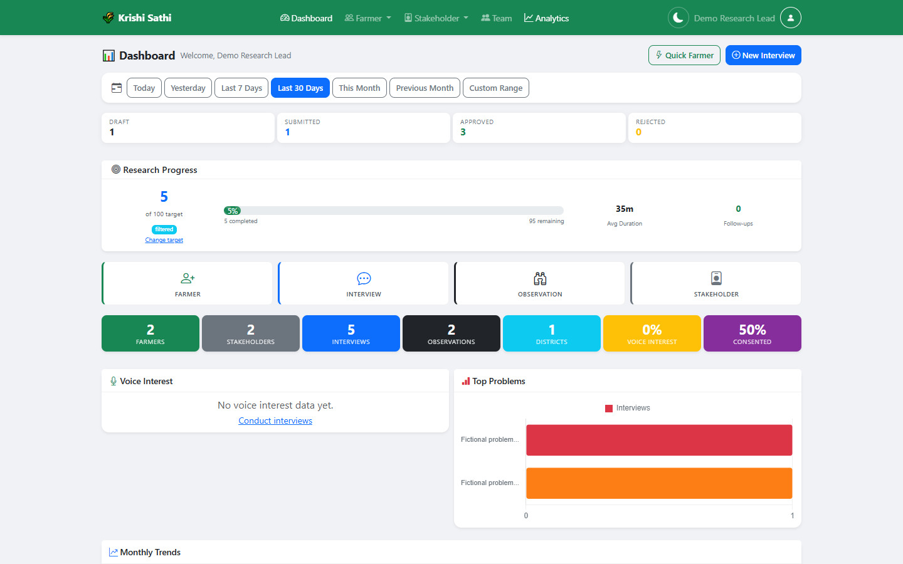

## Workflow

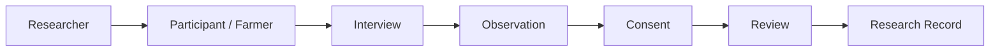

The research record moves from field capture to review/approval, with a
role-based model (Research Lead, Editor, Contributor, Viewer) governing who can
view, edit or approve each stage.

## Screenshot Tour

### Field Research Dashboard

<table>
  <tr>
    <td width="50%"></td>
    <td width="50%">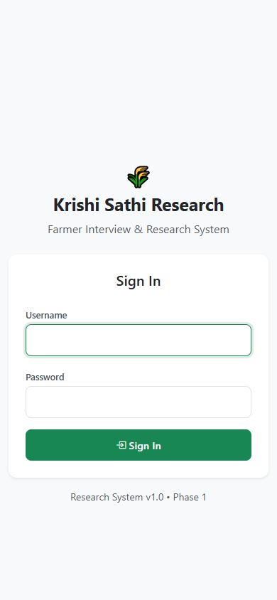</td>
  </tr>
</table>

### Farmers &amp; Participants

<table>
  <tr>
    <td width="50%">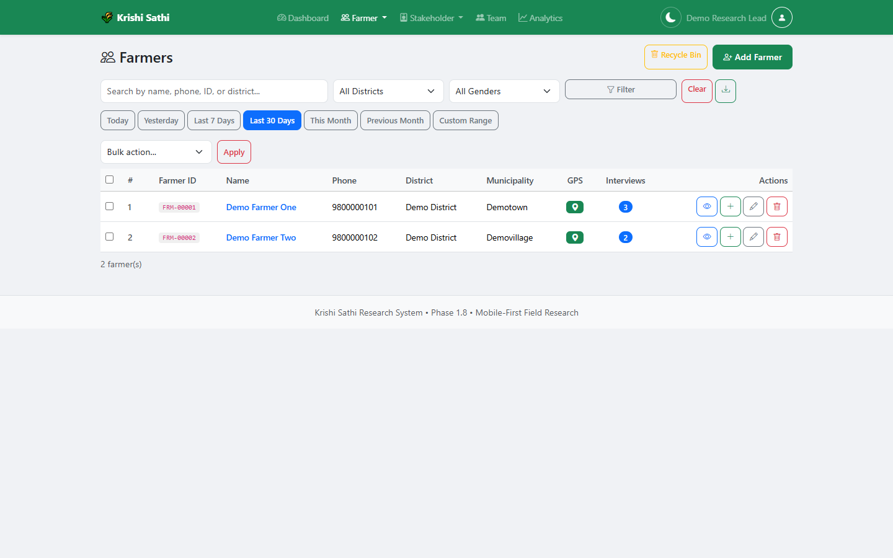</td>
    <td width="50%"></td>
  </tr>
  <tr>
    <td width="50%">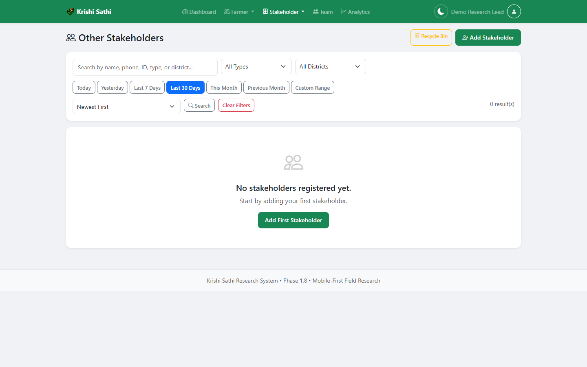</td>
    <td width="50%">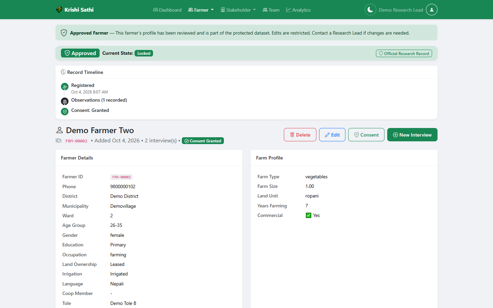</td>
  </tr>
</table>

### Interview Workflow

<table>
  <tr>
    <td width="50%">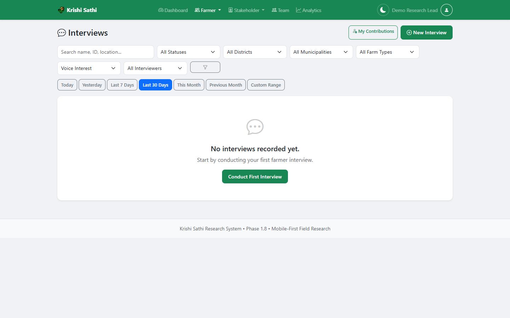</td>
    <td width="50%">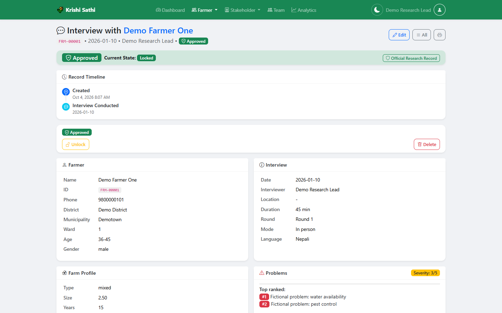</td>
  </tr>
</table>

### Consent &amp; Observations

<table>
  <tr>
    <td width="50%">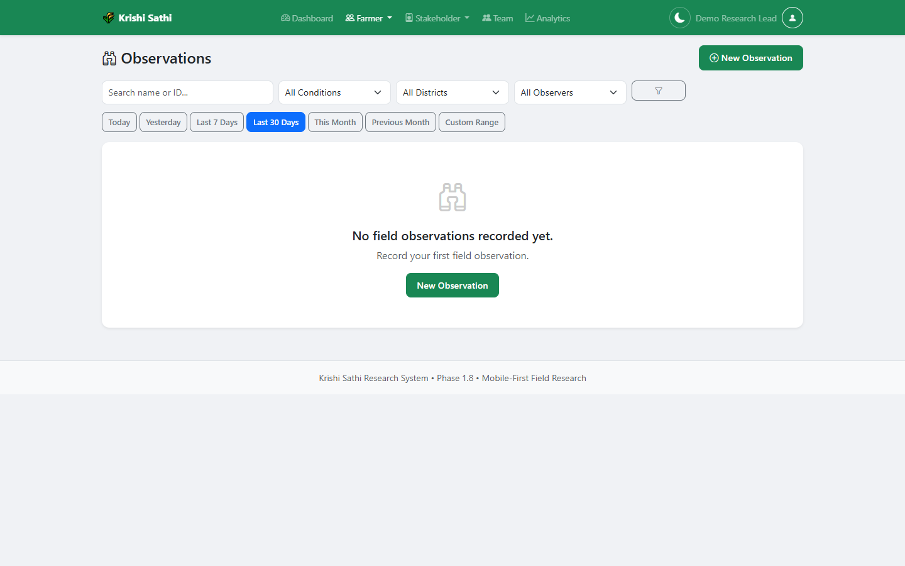</td>
    <td width="50%">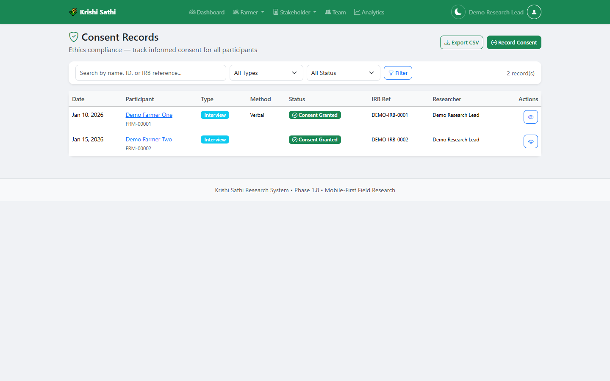</td>
  </tr>
</table>

### Research Review &amp; Access

<table>
  <tr>
    <td width="50%">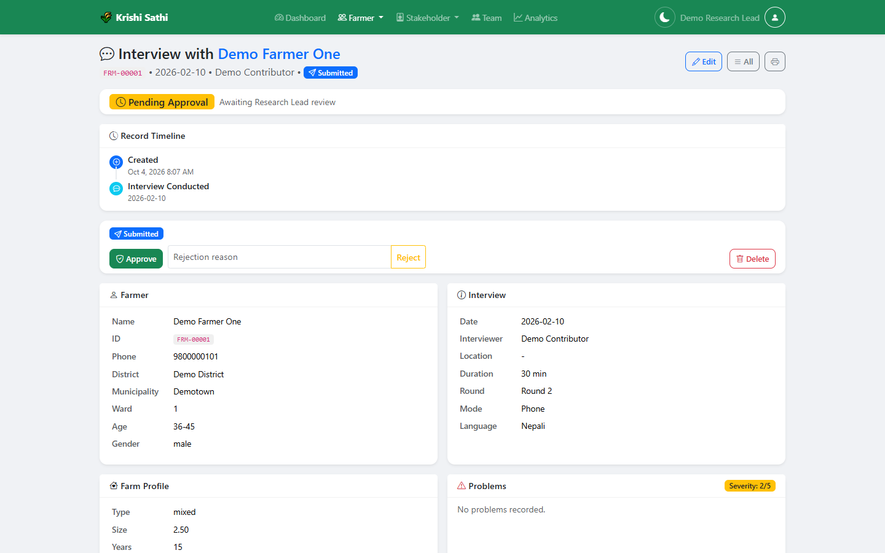</td>
    <td width="50%">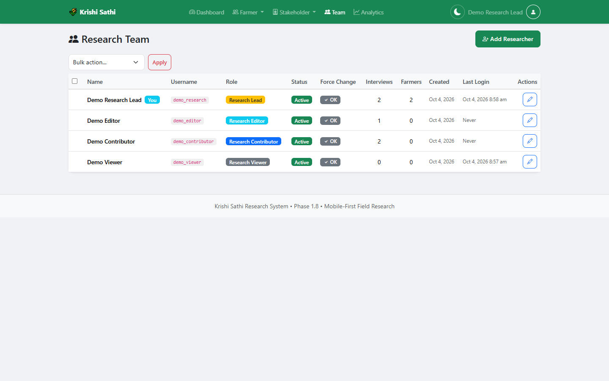</td>
  </tr>
</table>

> Screenshots are captured from this sanitized demo edition using fictional
demo data only. See [`docs/images/`](docs/images/) for the full set.

## Features

- Role-based access: Research Lead, Editor, Contributor, Viewer
- Farmer management (registration, farm profiles, approval workflow)
- Participant management (service providers, experts, other roles)
- Interview workflows with structured question groups and responses
- Field observations linked to farmers/participants/interviews
- Consent tracking (type, method, status, witness, IRB reference)
- Problem ranking and severity capture
- Field media (photos/audio/video) with safe placeholders
- Location capture (province / district / municipality / ward, GPS)
- Research review / approval and an audit trail
- Exports (farmers, participants, interviews, consent)

## Tech stack

- PHP 8.x (no framework; server-rendered pages)
- MySQL / MariaDB (utf8mb4), PDO
- Vanilla JS + CSS front-end

## Project structure

```
index.php                 login
dashboard.php             role-aware dashboard
farmers.php               farmer list / management
participants.php          participant list / management
interviews.php            interview workflow
observations.php          observation workflow
consent.php               consent tracking
config.php                env-driven configuration
database/                 schema.sql + demo_seed.sql + README
uploads/                  runtime media (excluded from Git)
```

## Database setup

```bash
mysql -u root -p < database/schema.sql
mysql -u root -p krishi_sathi_research_demo < database/demo_seed.sql
```

See [`database/README.md`](database/README.md).

## Installation (local)

1. Place the project in your web root, e.g. `htdocs/krishi-sathi-research`.
2. Optionally copy `.env.example` to `.env` and set `DB_*` and `APP_URL`.
   With no `.env`, it defaults to XAMPP (`root`, empty password) and the
   `krishi_sathi_research_demo` database.
3. Import the schema and demo seed (above).
4. Open `http://localhost/krishi-sathi-research/`.

## Demo credentials

| Role | Username | Password |
|---|---|---|
| Research Lead | `demo_research` | `DemoResearch@123` |
| Editor | `demo_editor` | `DemoEditor@123` |
| Contributor | `demo_contributor` | `DemoContributor@123` |
| Viewer | `demo_viewer` | `DemoViewer@123` |

## Privacy model

This edition contains **no real research data**. Participant identities,
consent records and media from the original deployment are excluded. The demo
database is generated from the schema and populated with fictional records,
using fake coordinates and placeholder descriptions.

## Known limitations

- Portfolio edition, not production-hardened.
- Media uploads are supported but only placeholder content ships.
- Some administrative tools (schema sync / migration scripts) are retained for
  reference and are not part of the demo flow.

## Contributing

See [CONTRIBUTING.md](CONTRIBUTING.md) and [SECURITY.md](SECURITY.md).

## License

MIT — see [LICENSE](LICENSE).

## Related project

**[Phool Delivery](https://github.com/youvrajgit1432/phool-delivery-platform)**
— Multi-Sided Commerce & Last-Mile Delivery Platform. Originally the same
infrastructure; maintained as a separate repository.
